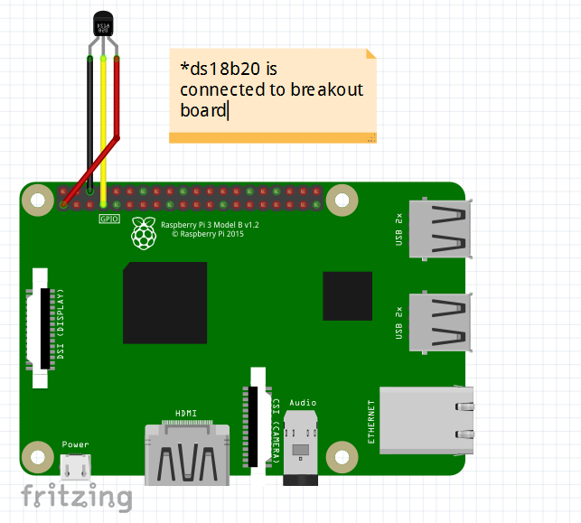
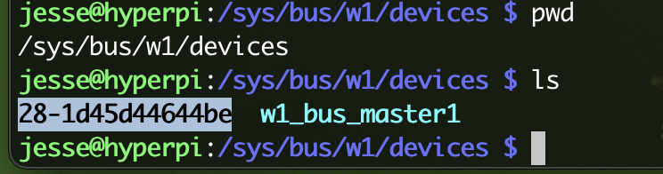
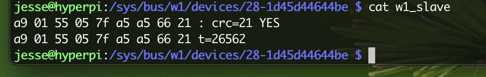

- [Summary](#summary)
  - [Requirements](#requirements)
  - [Raspberry Pi](#raspberry-pi-details)
  - [Raspberry Pi Camera](#raspberry-camera)
  - [Raspberry Pi Sensor](#raspberry-pi-temperature-sensor)
  - [Raspberry Pi Sensor Setup](#raspberry-pi-temp-sensor-setup)
  - [Rpicam](#raspberry-pi-camera)
  - [References](#references)


## Summary
An application written in Go to capture ds18b20 temperature information. An alternative to applications written in Python. Additionally, this appliation is to work with a sensor to trigger a camera recording--again in Golang versus Python. Most examples as of today are mainly writen in Python. 

# Requirements
1. Raspberry Pi 4+
2. Camera Module Sony Exmor IMX219 or similar. 
3. Temperature sensor (DS18B20) or similar.
4. Operating System Ubuntu Raspberry Pi https://ubuntu.com/raspberry-pi
5. Go 1.23.x+ 
6. rpicam-* (formally known as libcamera-*) https://www.raspberrypi.com/documentation/computers/camera_software.html

## Raspberry Pi Details
Model: Raspberry Pi 4 Model B Rev 1.4, 8GB

### Raspberry Pi Camera
* Camera: Raspberry Pi Camera Module V2-8 Megapixel,1080p (RPI-CAM-V2)
* Memory: 12GB
* Sony Exmor IMX219 Sensor Capable of 4K30 1080P60 720P180 8MP Still
* Maximum of 1080P30 and 8MP Stills in Raspberry Pi Board

### Raspberry Pi Temperature Sensor
* DS18B20 Waterproof Temperature Sensor Module DS18B20
* 1m Wire Digital Thermometer Probe Terminal Adapter
* Temperature Sensor Supply Voltage: 3.0V ~ 5.25V
* How to Wire, source (piddlerintheroot.com)



### Raspberry Pi Temp Sensor Setup
* Edit `config.txt` in `/boot/firmware/`
  * Add: `dtoverlay=w1-gpio`, save.
* reboot `sudo reboot`
* `sudo modprobe w1-gpio`
* `sudo modprobe w1-therm`
* Navigate to `cd /sys/bus/w1/devices`
* If all is wired and configured correct to this point. You should see something similar to: 





## Rpicam
Standard Camera Video Capture, https://www.raspberrypi.com/documentation/computers/camera_software.html
- About 17MB, 20 Second video.
```bash 
rpicam-vid -b 9000000 -t 20000 --width 1920 --height 1080 --codec libav --libav-audio -o test.mp4
```

# References
1. ["Raspberry Pi Camera Module: More on video capture" by Ashley Whittaker](https://www.raspberrypi.com/news/raspberry-pi-camera-module-more-on-video-capture/)
2. [Raspberry Pi Docs](https://www.raspberrypi.com/documentation/computers/camera_software.html)

